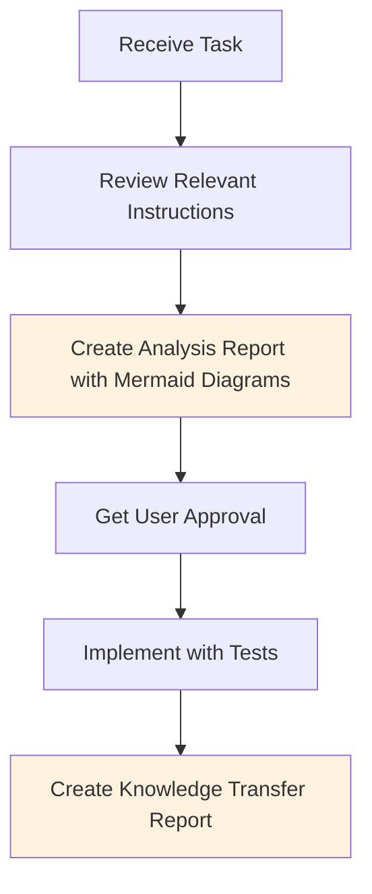

# Cracking Shells Playbook

**The comprehensive instruction set for LLM coding agents working within the Cracking Shells organization.**

This playbook provides standardized guidelines, workflows, and best practices that ensure consistency, quality, and efficiency across all repositories in the organization. It serves as the authoritative reference for AI coding agents to understand organizational standards and deliver high-quality contributions.

## Table of Contents

- [Overview](#overview)
- [Quick Start for LLM Agents](#quick-start-for-llm-agents)
- [Instruction Categories](#instruction-categories)
- [Instruction File Organization](#instruction-file-organization)
- [How to Use This Playbook](#how-to-use-this-playbook)
- [Contributing](#contributing)

## Overview

The Cracking Shells Playbook is a living document system that defines:

- **Development workflows** for Git, testing, and code changes
- **Documentation standards** for technical writing and visual diagrams
- **Reporting guidelines** for analysis, implementation, and knowledge transfer
- **Work ethics** promoting thoroughness, persistence, and quality
- **Organizational conventions** ensuring consistency across projects

### Philosophy

This playbook embodies the organization's commitment to:

- **Quality over speed**: Thorough analysis and implementation
- **Documentation-driven development**: Clear, comprehensive documentation
- **Test-driven validation**: Robust testing at all stages
- **Systematic problem-solving**: Root cause analysis over shortcuts
- **Knowledge preservation**: Comprehensive reporting and knowledge transfer

## Quick Start for LLM Agents

### First-Time Setup

1. **Read this README** to understand the playbook structure
2. **Review [Work Ethics](./instructions/work-ethics.instructions.md)** for core principles
3. **Study [Git Workflow](./instructions/git-workflow.md)** for commit and branching standards
4. **Understand [Reporting Guidelines](./instructions/reporting.instructions.md)** for documentation requirements

### Standard Workflow

### Essential Instructions by Task Type

| Task Type | Required Reading |
|-----------|-----------------|
| **New Feature** | [Code Change Phases](./instructions/code-change-phases.instructions.md), [Testing](./instructions/testing.instructions.md), [Reporting](./instructions/reporting.instructions.md) |
| **Bug Fix** | [Work Ethics](./instructions/work-ethics.instructions.md), [Testing](./instructions/testing.instructions.md), [Git Workflow](./instructions/git-workflow.md) |
| **Documentation** | [Documentation](./instructions/documentation.instructions.md), [Style Guide](./instructions/documentation-style-guide.instructions.md), [Resources](./instructions/documentation-resources.instructions.md) |
| **Refactoring** | [Code Change Phases](./instructions/code-change-phases.instructions.md), [Testing](./instructions/testing.instructions.md) |
| **Testing** | [Testing](./instructions/testing.instructions.md), [Reporting](./instructions/reporting.instructions.md) |

## Instruction Categories

The playbook is organized into specialized instruction files covering different aspects of development:

```mermaid
graph TD
    Playbook[Cracking Shells Playbook]
    
    Playbook --> Workflow[Workflow & Process]
    Playbook --> Docs[Documentation]
    Playbook --> Quality[Quality & Testing]
    Playbook --> Ethics[Work Ethics]
    
    Workflow --> Git[Git Workflow]
    Workflow --> Phases[Code Change Phases]
    Workflow --> Reporting[Reporting Guidelines]
    Workflow --> Roadmap[Roadmap Generation]
    
    Docs --> DocMain[Documentation Overview]
    Docs --> Structure[Structure Standards]
    Docs --> Style[Style Guide]
    Docs --> API[API Documentation]
    Docs --> Resources[Resources & Diagrams]
    Docs --> MkDocs[MkDocs Setup]
    Docs --> Tutorials[Tutorial Writing]
    Docs --> README[README Standards]
    
    Quality --> Testing[Testing Guidelines]
    Quality --> Analytic[Analytic Behavior]
    Quality --> Docstrings[Python Docstrings]
    
    Ethics --> WorkEthics[Work Ethics Guidelines]
    
    style Playbook fill:#e1f5ff
    style Workflow fill:#fff4e1
    style Docs fill:#e8f5e9
    style Quality fill:#f3e5f5
    style Ethics fill:#fce4ec
```

## Instruction File Organization

### 📋 Workflow & Process
- **[git-workflow.md](./instructions/git-workflow.md)** - Git commit standards, branching strategy, and version control
- **[code-change-phases.instructions.md](./instructions/code-change-phases.instructions.md)** - Structured approach to implementing changes
- **[reporting.instructions.md](./instructions/reporting.instructions.md)** - Report creation, organization, and iteration
- **[roadmap-generation.instructions.md](./instructions/roadmap-generation.instructions.md)** - Product roadmap and planning standards

### 📚 Documentation
- **[documentation.instructions.md](./instructions/documentation.instructions.md)** - Master documentation guidelines and overview
- **[documentation-structure.instructions.md](./instructions/documentation-structure.instructions.md)** - Directory organization and file naming
- **[documentation-style-guide.instructions.md](./instructions/documentation-style-guide.instructions.md)** - Writing tone, language, and content standards
- **[documentation-api.instructions.md](./instructions/documentation-api.instructions.md)** - API documentation with mkdocstrings
- **[documentation-resources.instructions.md](./instructions/documentation-resources.instructions.md)** - **Mermaid diagrams (PRIMARY)**, images, and assets
- **[documentation-mkdocs-setup.instructions.md](./instructions/documentation-mkdocs-setup.instructions.md)** - MkDocs configuration and setup
- **[documentation-tutorials.instructions.md](./instructions/documentation-tutorials.instructions.md)** - Tutorial and guide writing
- **[readme.instructions.md](./instructions/readme.instructions.md)** - README file standards

### ✅ Quality & Testing
- **[testing.instructions.md](./instructions/testing.instructions.md)** - Testing strategy, coverage, and best practices
- **[analytic-behavior.instructions.md](./instructions/analytic-behavior.instructions.md)** - Analytical thinking and problem-solving
- **[python_docstrings.instructions.md](./instructions/python_docstrings.instructions.md)** - Python docstring standards

### 💪 Work Ethics
- **[work-ethics.instructions.md](./instructions/work-ethics.instructions.md)** - Core principles of thoroughness, persistence, and quality

## How to Use This Playbook

### For LLM Coding Agents

#### 1. Identify Relevant Instructions
- Check the task type mapping in [Essential Instructions by Task Type](#essential-instructions-by-task-type)
- Review the `applyTo` field in instruction file frontmatter
- Read the relevant instruction files completely

#### 2. Follow the Standard Workflow
All development follows: **Analysis → Test Definition → User Approval → Implementation → Knowledge Transfer**

**Key Principles**:
- Create reports for analysis, test definitions, and knowledge transfer
- Iterate on reports with user feedback before implementation
- Define tests before implementing
- Use Mermaid diagrams to visualize architecture, workflows, and data flows

#### 3. Maintain Quality Standards
From [Work Ethics](./instructions/work-ethics.instructions.md):
- Root cause analysis over shortcuts
- Systematic debugging with evidence-based validation
- Research-first approach before implementation
- Commit discipline with clear, focused commits

See [Reporting Guidelines](./instructions/reporting.instructions.md) and [Documentation Resources](./instructions/documentation-resources.instructions.md) for detailed standards.

### For Human Developers

This playbook serves as an onboarding guide, reference documentation, and quality checklist for understanding organizational standards and working effectively with AI coding agents.

## Contributing

### Updating Instructions

1. Identify which instruction files need updates
2. Ensure changes align with existing standards
3. Update cross-references in related instruction files
4. Test against existing repositories
5. Document rationale for changes

### Quality Standards

All playbook updates must:
- ✅ Follow the organization's own standards (dogfooding)
- ✅ Include clear examples and use cases
- ✅ Use Mermaid diagrams where appropriate
- ✅ Maintain backward compatibility when possible

## License

This playbook is licensed under the AGPL-3.0 License - see the [LICENSE](LICENSE) file for details.

---

**Maintained by**: Cracking Shells Organization
**Last Updated**: 2025-11-07
**Version**: 1.0.0

**For questions or suggestions**, please open an issue in this repository.

