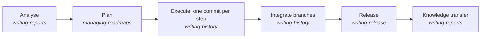

# Cracking Shells Playbook

[](https://github.com/CrackingShells/cracking-shells-playbook/actions/workflows/release.yml)
[](LICENSE)

How the Cracking Shells organization builds software and runs projects, packaged as agent skills that Claude Code, Codex and Agent Plugins 1.0 clients can install.

Each skill teaches an agent one part of the work: planning a campaign as a roadmap, writing the reports stakeholders review, keeping a clean commit history, and announcing releases. The skills are written for agents first. A maintainer reads them to know what the agent was told.

## Skills

| Skill | What it does | Agent plugin |
|:------|:-------------|:------------:|
| [`managing-roadmaps`](skills/managing-roadmaps/SKILL.md) | Plans a campaign as a directory-tree roadmap under `__roadmap__/`, then executes and amends it. Ships the `dirtree-rdm` CLI that validates every roadmap file. | ✅ |
| [`writing-reports`](skills/writing-reports/SKILL.md) | Writes stakeholder-reviewable reports under `__reports__/`: architecture, test definition, knowledge transfer, findings, observation, notice and open question. | ✅ |
| [`writing-history`](skills/writing-history/SKILL.md) | Derives a project's commit vocabulary from its history, authors commits against it, sets up versioning, and integrates branches by rebase then `merge --no-ff`. | ✅ |
| [`writing-release`](skills/writing-release/SKILL.md) | Writes pull request bodies and Discord announcements for the fork → `dev` → `main` release model used across the org. | ✅ |
| [`spawning-agent-plugins`](skills/spawning-agent-plugins/SKILL.md) | Turns a repository's skills, MCP server or hooks into installable plugins for Claude Code, Codex and Agent Plugins 1.0 clients. | ✅ |
| [`writing-prose`](skills/writing-prose/SKILL.md) | Drafts and revises prose the user signs in their own voice, with register control against LLM-default rhetoric. | — |
| [`writing-design-canons`](skills/writing-design-canons/SKILL.md) | Writes design canons: identity, token vocabulary, production guidelines and consumption guide for a visual system. | — |
| [`importing-design-figures`](skills/importing-design-figures/SKILL.md) | Renders a figure or table from a Claude Design project into a print-quality image placed in a local document. | — |

Skills marked ✅ are also listed as agent plugins in the [`CrackingShells/Nest`](https://github.com/CrackingShells/Nest) marketplace. Every skill is published as a `.skill` file with each of its releases.

### How the skills fit together


```mermaid
graph LR
    A["Analyse<br/><i>writing-reports</i>"] --> R["Plan<br/><i>managing-roadmaps</i>"]
    R --> E["Execute, one commit per step<br/><i>writing-history</i>"]
    E --> I["Integrate branches<br/><i>writing-history</i>"]
    I --> P["Release<br/><i>writing-release</i>"]
    P --> K["Knowledge transfer<br/><i>writing-reports</i>"]
```

An architecture or test-definition report comes first. Once it is approved, its decisions become a roadmap. Each roadmap step lands as one commit, and branches merge level by level. A knowledge-transfer report closes the cycle. The skills hand off to one another, so install `managing-roadmaps`, `writing-reports` and `writing-history` together to get the whole loop.

## Installation

### As agent plugins (Claude Code, Codex)

Add the org marketplace once, then install any plugin marked ✅ above.

```bash
claude plugin marketplace add CrackingShells/Nest
claude plugin install writing-history@cracking-shells
```

For Codex:

```bash
codex plugin marketplace add CrackingShells/Nest
codex plugin add writing-history@cracking-shells
```

Plugins update whenever the skill releases a new version. See the [Nest README](https://github.com/CrackingShells/Nest#readme) if you previously registered another marketplace named `cracking-shells`.

### As `.skill` files

Every skill, plugin or not, is published as `<skill-name>.skill` on the [Releases page](../../releases). A `.skill` file is a zip archive of the skill directory.

```bash
# Available in every project
unzip <skill-name>.skill -d ~/.claude/skills/

# Available in the current repository only
unzip <skill-name>.skill -d .claude/skills/
```

Restart Claude Code for the new skill to load. To build a `.skill` from source, or to rebuild the `dirtree-rdm` binary for an unsupported platform, see [CONTRIBUTING.md](CONTRIBUTING.md#building-a-skill-locally).

## Sister repositories

Skills that are not about how the org builds software live in their own repositories:

- [Plumage](https://github.com/CrackingShells/Plumage): the form of the work, such as prose voice, design canons, figures, coined terms and document formats.
- [Pinion](https://github.com/CrackingShells/Pinion): the mechanics of agents, such as plugin packaging and waits on long-running processes.

## Repository layout

| Path | Contents |
|:-----|:---------|
| `skills/<name>/` | The source of each skill. This is the only place a skill is edited. |
| `plugins/<name>/` | Plugin trees generated from `skills/`. Committed because Nest installs them by git source. Never edited by hand. |
| `instructions/` | Legacy instruction files that are not yet converted into skills (documentation standards, Python docstrings, the code-change workflow). They will be converted or retired. |
| `__reports__/` | Design and verification reports from past campaigns on this repository. |
| `__roadmap__/` | The roadmaps those campaigns executed, kept as the specification each change was built against. |
| `tools/` | Packaging, plugin assembly and version-stamping scripts used by the pre-commit hook and the release pipeline. |

## Contributing

[CONTRIBUTING.md](CONTRIBUTING.md) covers the development setup, the pre-commit hook, how plugin trees are regenerated, and how commits drive per-skill releases. Questions and suggestions go to the [issue tracker](https://github.com/CrackingShells/cracking-shells-playbook/issues).

## License

AGPL-3.0. See [LICENSE](LICENSE).
