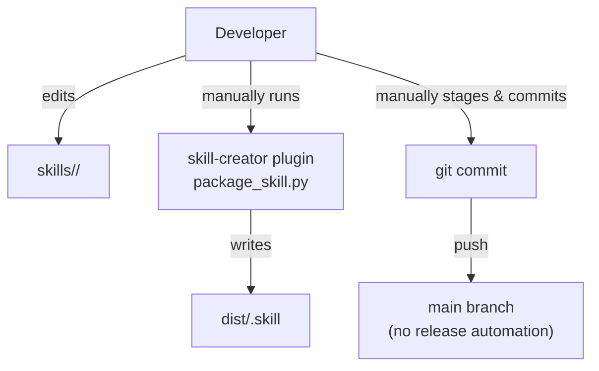
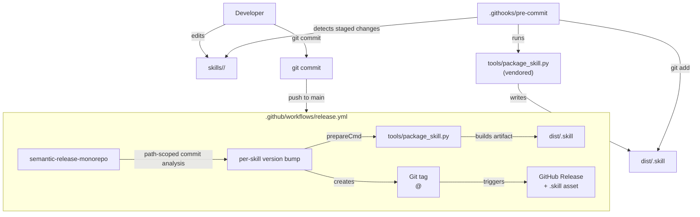
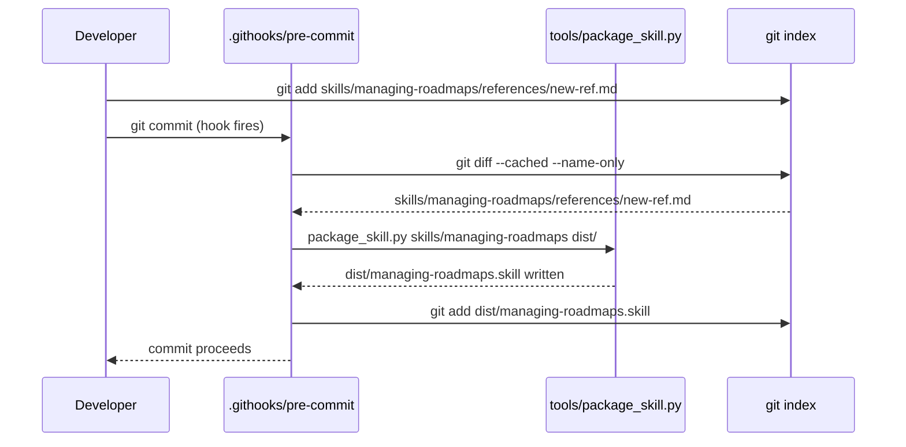
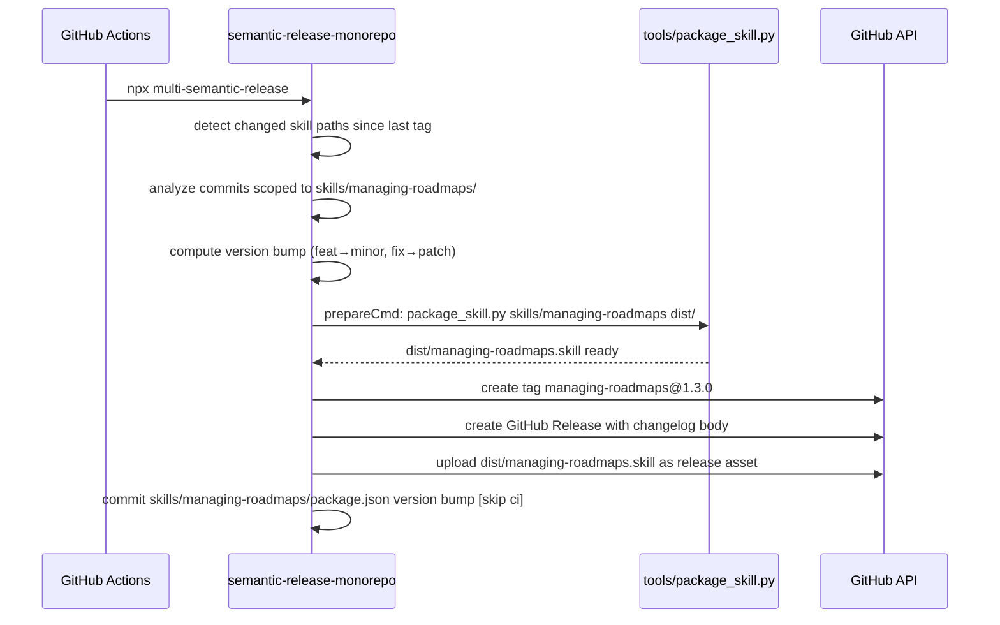

# Skill CI/CD Pipeline — Architecture Analysis (v0)

Date: 2026-04-13

## Executive Summary

- **Problem:** `dist/` is synced manually; no versioning exists per skill; no automated release pipeline.
- **Proposed change:** Add a pre-commit hook (local sync), per-skill semantic versioning via `semantic-release-monorepo`, and a GitHub Actions workflow that publishes tagged `.skill` artifacts to GitHub Releases.
- **Non-goals:** Multi-platform packaging, dependency management for skill consumers, notification systems.
- **Biggest risks:** `pyyaml` not installed in CI; hook bypass via `--no-verify`; `semantic-release-monorepo` path attribution not matching commit scope conventions.
- **Validation approach:** Dry-run `npx multi-semantic-release --dry-run` locally; inspect generated tag format; verify `.skill` exclusion of `package.json`.

---

## Current State



Pain points in current state:
- `dist/` diverges silently (3 skills were stale before this session)
- Packager lives in a session-specific plugin path — not reproducible across environments
- No versioning: consumers cannot pin to a skill version
- No release artifacts: `.skill` files are only distributed via git clone

---

## Proposed State



---

## Key Flows

### Pre-commit hook flow



### Release pipeline flow (push to main)



---

## Contracts & Invariants

### `tools/package_skill.py`

```
package_skill(skill_path: Path, output_dir: Path | None) -> Path | None

Invariants:
  - output is always <output_dir>/<skill_path.name>.skill
  - SKILL.md must exist at skill_path root or function returns None
  - EXCLUDE_FILES must contain "package.json" (added in vendored version)
  - ROOT_EXCLUDE_DIRS must contain "evals"
  - EXCLUDE_DIRS must contain "__pycache__", "node_modules"
  - Artifact NEVER contains: package.json, *.pyc, .DS_Store, evals/
```

### `skills/<name>/package.json`

```json
{ "name": "<skill-name>", "version": "<semver>" }

Invariants:
  - "name" must exactly match the skill directory name
  - "name" must match the "name" field in SKILL.md frontmatter
  - "version" is managed by semantic-release (not hand-edited)
  - file is excluded from .skill artifact by tools/package_skill.py
```

### Tag format

```
<skill-name>@<semver>     e.g.  managing-roadmaps@1.3.0

Invariants:
  - skill-name is the npm package "name" (must be kebab-case)
  - semver follows conventional commit bump rules:
      feat → minor,  fix/perf → patch,  BREAKING CHANGE → major
  - Tags are immutable once pushed
```

### Pre-commit hook

```
Inputs:  git staged file list
Outputs: dist/<skill>.skill staged alongside skill changes

Invariants:
  - If skills/<name>/ has staged changes AND skills/<name>/ still exists
    → dist/<name>.skill is built and staged
  - If skills/<name>/ is fully deleted
    → dist/<name>.skill is unstaged and deleted
  - Hook exits non-zero if package_skill.py fails (blocks the commit)
  - Hook does NOT run for changes outside skills/
```

### Error model

| Failure | Surface | Recovery |
|---------|---------|----------|
| `SKILL.md` missing | `package_skill.py` exits 1 | Hook blocks commit; fix SKILL.md |
| YAML frontmatter invalid | `quick_validate.py` returns error | Hook blocks commit; fix frontmatter |
| `pyyaml` not installed | `ModuleNotFoundError` in hook | Run `make dev-setup` |
| No conventional commits for a skill | SR: no release | Expected; no action needed |
| `--no-verify` bypass | dist/ may diverge | CI release job is the safety net |

---

## Alternatives Considered

### Commit attribution: path filtering vs. scope filtering

| | Path filtering | Scope filtering |
|--|--|--|
| **How** | SR-monorepo scans which files each commit touched | Filter by conventional commit scope name |
| **Reliability** | Objective — file paths are facts | Requires discipline: scope must match skill name |
| **Current repo** | Works as-is | Partially inconsistent (`dirtree-rdm` ≠ `managing-roadmaps`) |
| **Decision** | **Path filtering (winner)** | Rejected — scope drift is already present |

### Packager sourcing: submodule vs. vendor

| | Submodule | Vendor into `tools/` |
|--|--|--|
| **Freshness** | Tracks upstream automatically | Manual update |
| **Friction** | `git submodule update --init` required | Zero friction |
| **Dependencies** | Session plugin path (ephemeral) | Stdlib + `pyyaml` only |
| **Decision** | Rejected | **Vendor (winner)** — script is 80 lines of stdlib |

### Release tooling: custom matrix vs. `semantic-release-monorepo`

| | Custom GH Actions matrix | `semantic-release-monorepo` |
|--|--|--|
| **Commit analysis** | Custom script | Built-in path-scoped SR |
| **package.json required** | No | Yes (per skill) |
| **Org familiarity** | Low | High (same SR ecosystem) |
| **Maintenance** | Higher | Lower |
| **Decision** | Rejected | **SR-monorepo (winner)** |

### Single workflow vs. two workflows

Option considered: split CI into (1) versioning workflow and (2) tag-triggered packaging workflow. Rejected in favor of a single workflow where `@semantic-release/exec` (prepareCmd) handles packaging inline, and `@semantic-release/github` uploads the asset. Fewer moving parts; asset is built in the same job that creates the release.

---

## Risks & Mitigations

| Risk | Likelihood | Impact | Mitigation |
|------|-----------|--------|------------|
| `pyyaml` absent in CI | Medium | Blocks release | Explicit `pip install pyyaml` step in workflow |
| Hook bypassed via `--no-verify` | Medium | `dist/` diverges | CI release job repackages via `prepareCmd` regardless |
| Commit touches multiple skills | Low | Both get released | Expected behavior; each analyzed independently |
| `package.json` name ≠ skill dir name | Low | Tag format wrong | Invariant documented; SKILL.md `name:` already validated |
| `managing-roadmaps.skill` is large (~2 MB, binaries) | Certain | Large GH Release asset | Acceptable; binaries are required for the skill to function |
| First run: no prior tag → SR releases all skills at once | Certain | Noisy initial release | Expected; document in CONTRIBUTING.md |

---

## Roadmap Recommendation

Implementation is a single focused sprint with no multi-phase dependency chain. Milestone sketch:

1. Vendor packager (`tools/`) + add `package.json` exclusion
2. Per-skill `package.json` markers + root `package.json`
3. `.releaserc.js` + validate with `--dry-run`
4. `.githooks/pre-commit` + `Makefile dev-setup`
5. `.github/workflows/release.yml`

Consider using `managing-roadmaps` skill for a formal campaign roadmap if implementation is deferred or assigned to another contributor.
