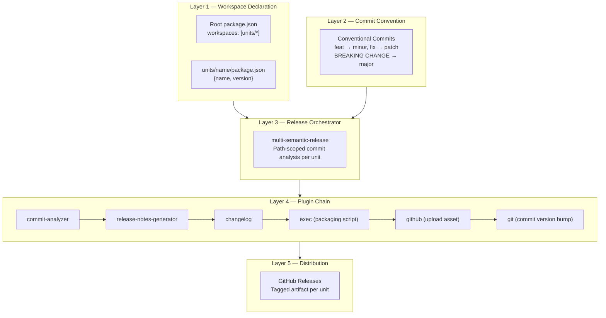
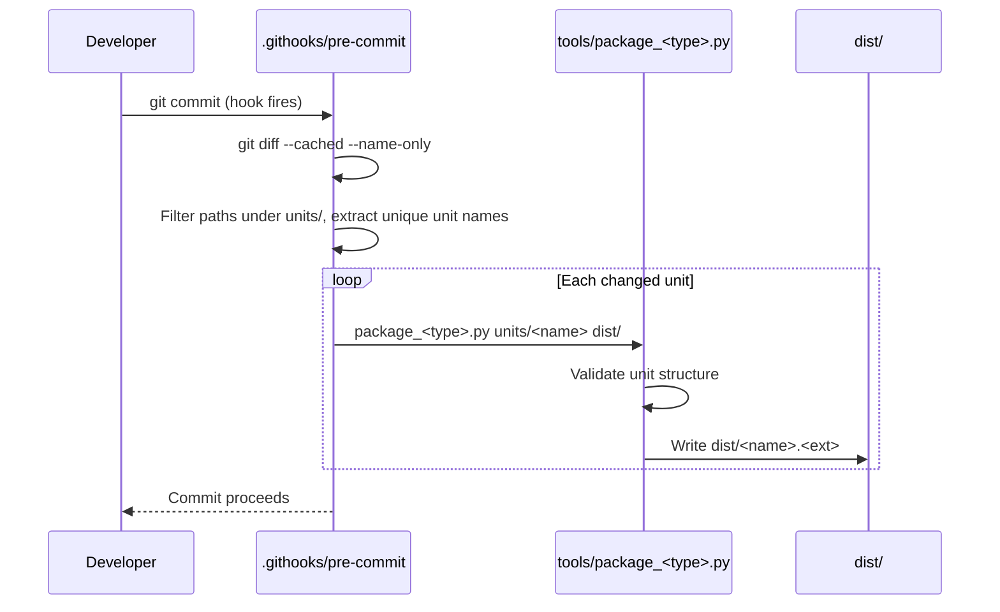
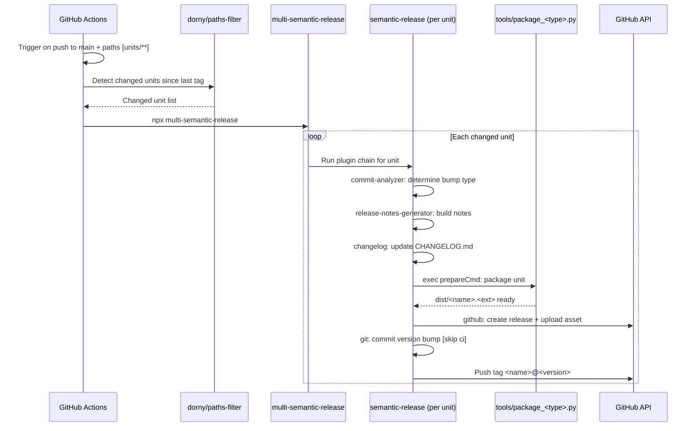

# Monorepo Auto-Version Pipeline — Architecture Analysis (v0)

Date: 2026-06-28

## Executive Summary

- **Problem:** A monorepo containing independently-versioned content units needs automated version bumping, changelog generation, artifact packaging, and distribution — without coordinated releases or manual version management.
- **Implemented solution:** npm workspaces + Conventional Commits + `multi-semantic-release` + GitHub Actions + custom packaging scripts + GitHub Releases as distribution channel.
- **Generalizability verdict:** High. The pipeline is content-type-agnostic except for one component: the packaging script. Everything else — workspace declaration, commit convention, release orchestration, CI workflow, pre-commit hook — transfers directly to any content type (plugins, configs, schemas, documentation bundles, compiled tools).
- **Biggest risks:** npm workspace coupling forces a `package.json` on non-npm content; no local commitlint means malformed commits pass locally; `[skip ci]` convention prevents loops but is fragile.
- **Validation approach:** `npx multi-semantic-release --dry-run` locally; inspect generated tags and changelog; verify packaged artifact contents.

---

## System Overview

The pipeline is organized in five layers. Only Layer 4 (packaging) is content-type-specific.



### How layers compose

| Layer | What it does | What makes it generalizable |
|-------|-------------|---------------------------|
| **1. Workspace** | Declares which directories are independent units | Change the glob pattern (`units/*` → `plugins/*`, `schemas/*`, etc.) |
| **2. Commits** | Maps commit types to version-bump severity | Content-agnostic — `feat:` and `fix:` apply to any deliverable |
| **3. Orchestrator** | Determines which units changed since their last tag; runs the plugin chain per unit | Path-based attribution: works for any directory structure |
| **4. Plugin chain** | Analyzes, generates notes, packages, publishes, commits | Only `exec` (packaging) is content-specific; all other plugins are generic |
| **5. Distribution** | Hosts versioned artifacts as GitHub Release assets | Format-agnostic — any file type can be an asset |

---

## Component Inventory

### Shared configuration

| Component | File | Purpose | Generalizable? |
|-----------|------|---------|---------------|
| Root workspace | `package.json` | Declares `"workspaces": ["skills/*"]` | Yes — change the glob |
| Release config factory | `release-config.js` | Exports a function parameterized by unit name; returns full semantic-release config | Yes — change `prepareCmd` and `assets` path |
| Dev dependencies | `package.json` devDependencies | `semantic-release`, `multi-semantic-release`, SR plugins | Yes — identical for any content type |
| Developer onboarding | `Makefile` `dev-setup` target | Registers git hooks, installs uv, runs `npm install` | Yes — adapt tool installs |
| Commit convention docs | `CONTRIBUTING.md` | Documents prefix → bump mapping | Yes — content-agnostic |

### Per-unit configuration

| Component | File pattern | Purpose | Generalizable? |
|-----------|-------------|---------|---------------|
| Version marker | `<unit>/package.json` | `{"name": "<unit>", "version": "<semver>"}` | Yes — minimal, no npm-specific fields needed |
| Release config | `<unit>/.releaserc.js` | `require('../../release-config')('<unit>')` | Yes — one-line delegation |
| Changelog | `<unit>/CHANGELOG.md` | Auto-generated per release | Yes — managed by SR plugin |

### CI and local tooling

| Component | File | Purpose | Generalizable? |
|-----------|------|---------|---------------|
| CI workflow | `.github/workflows/release.yml` | Detects changes, optionally builds binaries, runs `multi-semantic-release` | Mostly — adjust path filters and build steps |
| Pre-commit hook | `.githooks/pre-commit` | Detects staged unit changes, runs packager locally | Yes — change packager invocation |
| Packaging script | `tools/package_skill.py` | Validates and ZIPs a skill directory | **No** — content-type-specific (must be rewritten per type) |
| Validation script | `tools/quick_validate.py` | Validates SKILL.md frontmatter | **No** — content-type-specific |

---

## Key Flows

### Local commit flow



The pre-commit hook is a safety net, not the release mechanism. It keeps `dist/` current for local testing. The actual release happens in CI.

### CI release flow



### Change detection mechanism

The `dorny/paths-filter` action compares the current push against the most recent tag for each unit. This means:

- A commit touching `units/alpha/` and `units/beta/` triggers independent releases for both
- A commit touching only `units/alpha/` does not release `beta`
- With no prior tags (first run), all units release simultaneously

---

## Contracts & Invariants

### Unit manifest

```
File:    <unit>/package.json
Schema:  { "name": "<kebab-case-name>", "version": "<semver>" }

Invariants:
  - "name" must exactly match the directory name
  - "version" is managed by semantic-release (never hand-edited)
  - File is excluded from the distributed artifact by the packaging script
```

### Tag format

```
Pattern: <unit-name>@<semver>

Examples: managing-roadmaps@1.1.1, writing-reports@1.1.2

Invariants:
  - unit-name matches the npm package "name" field (kebab-case)
  - semver follows conventional commit bump rules
  - Tags are immutable once pushed
```

### Release commit

```
Pattern: chore(release): <unit-name>@<version> [skip ci]

Invariants:
  - [skip ci] prevents infinite CI loops
  - Commit modifies only package.json (version) and CHANGELOG.md
  - Commit is authored by the CI bot
```

### Packaging contract (content-type-specific)

```
Input:   Path to a unit directory
Output:  A single distributable artifact at dist/<name>.<ext>

Invariants:
  - Unit must pass validation before packaging
  - Build artifacts and metadata files are excluded
  - Output filename matches the unit directory name
  - Packaging is idempotent (same input → same output)
```

### Error model

| Failure | Where it surfaces | Recovery |
|---------|------------------|----------|
| Malformed commit message | CI: commit-analyzer ignores it | No release; contributor re-commits correctly |
| Unit validation fails | Pre-commit hook blocks commit | Fix validation errors before committing |
| Packaging script fails | Pre-commit hook blocks commit; CI release fails | Fix the unit or the packager |
| No conventional commits for a unit | multi-semantic-release: no release | Expected behavior; no action needed |
| `--no-verify` bypasses hook | dist/ diverges from source | CI release re-packages regardless; dist/ is not committed |
| `[skip ci]` missing from release commit | CI re-triggers on the release commit | Release commit template must include `[skip ci]` |

---

## Pros and Cons

### Pros

| Advantage | Why it matters |
|-----------|---------------|
| **Independent versioning** | Each unit has its own semver lifecycle; no coordinated release trains |
| **Path-based attribution** | Version bumps are determined by which files changed, not by commit scope names — objective and drift-proof |
| **Zero per-unit CI config** | A single workflow handles all units; adding a new unit requires no workflow changes |
| **Factory pattern for release config** | Adding a new unit = one `.releaserc.js` file that delegates to the shared factory |
| **Standard ecosystem** | semantic-release is widely adopted; contributors likely have prior experience |
| **Local safety net** | Pre-commit hook keeps `dist/` in sync without developer discipline |
| **Atomic release per unit** | Each unit gets its own GitHub Release with changelog, tag, and downloadable artifact |

### Cons

| Disadvantage | Impact | Severity |
|-------------|--------|----------|
| **npm workspace coupling** | Every unit needs a `package.json` even if not an npm package. Creates a false signal that units are npm-publishable | Medium |
| **No local commitlint** | Malformed commits pass locally; only caught when CI runs (or never, if no release-worthy prefix) | Low |
| **`[skip ci]` fragility** | Release commit convention must include `[skip ci]`; if the template drifts, CI enters an infinite loop | Medium |
| **First-run noise** | No prior tags → all units release simultaneously on the first CI run | Low (one-time) |
| **Binary compilation complexity** | If any unit ships compiled binaries, CI needs a cross-compilation matrix that runs before the release job | High (when applicable) |
| **No rollback mechanism** | Once a GitHub Release is published, there is no automated way to unpublish or retract a version | Medium |
| **Hook bypass** | `git commit --no-verify` skips the pre-commit hook; `dist/` diverges from source | Low (CI is the safety net) |
| **Single-branch model** | Only `main` triggers releases; feature-branch preview releases are not supported out of the box | Low-Medium |

---

## Alternatives Considered

### Release orchestration: multi-semantic-release vs. Changesets vs. Lerna

| | multi-semantic-release | Changesets | Lerna |
|--|--|--|--|
| **Version determination** | Automated from commit messages | Manual: developer writes a changeset file per PR | Automated or manual |
| **Per-unit independence** | Built-in path-scoped analysis | Built-in per-package changesets | Built-in |
| **Human review of bumps** | None — fully automated | Yes — changeset files are PR-reviewable | Optional |
| **Ecosystem weight** | ~3 dependencies | ~5 dependencies | ~30+ dependencies |
| **Learning curve** | Low (standard SR) | Medium (new concept: changeset files) | High (many options) |
| **Decision** | **Winner** — automation matches the "commit and forget" workflow | Good for teams that want explicit version control | Over-engineered for non-npm content |

**When to reconsider:** If the team wants to review version bumps before they happen (e.g., for public APIs), Changesets is the better choice.

### Commit enforcement: local commitlint vs. CI-only

| | Local commitlint (pre-commit) | CI-only enforcement |
|--|--|--|
| **Feedback speed** | Immediate — blocked before commit | Delayed — fails after push |
| **Developer friction** | Adds ~200ms to every commit | None locally |
| **Agent compatibility** | May block AI agents that generate non-standard messages | No friction for agents |
| **Decision** | Rejected for now | **Winner** — agent workflows need flexibility |

**When to reconsider:** If commit quality degrades noticeably, add commitlint as a pre-commit hook.

### Packaging: inline exec vs. tag-triggered second workflow

| | Inline exec (current) | Tag-triggered second workflow |
|--|--|--|
| **Complexity** | Single workflow; packaging is a plugin step | Two workflows; packaging watches for new tags |
| **Atomicity** | Artifact is built in the same job that creates the release | Release is created first; artifact may fail to attach |
| **Debugging** | One log stream | Two separate workflow runs to correlate |
| **Decision** | **Winner** — fewer moving parts | Useful if packaging is very slow or needs different runners |

### Distribution: GitHub Releases vs. npm registry vs. custom registry

| | GitHub Releases (current) | npm registry | Custom registry |
|--|--|--|--|
| **Auth model** | GitHub token (already available) | npm token (separate secret) | Custom |
| **Content-type flexibility** | Any file as a release asset | npm packages only | Any |
| **Consumer ergonomics** | Download + unzip | `npm install` | Custom client |
| **Decision** | **Winner** for non-npm content | Only if units are actual npm packages | Only if org has specific registry needs |

---

## Generalization Template

To adapt this pipeline for a new content type, follow these steps. Items marked with a wrench need content-type-specific logic; everything else copies directly.

### Step 1 — Workspace structure

```
<repo-root>/
  package.json              ← add "workspaces": ["<units>/*"]
  release-config.js         ← parameterized factory (adjust prepareCmd + assets)
  Makefile                  ← dev-setup target
  .githooks/pre-commit      ← detect and repackage changed units
  .github/workflows/release.yml
  tools/
    package_<type>.py       ← 🔧 content-type-specific packager
    validate_<type>.py      ← 🔧 content-type-specific validator (optional)
  <units>/
    <name-a>/
      package.json          ← {"name": "<name-a>", "version": "1.0.0"}
      .releaserc.js         ← require('../../release-config')('<name-a>')
      CHANGELOG.md          ← auto-generated
      <content files>       ← 🔧 whatever this content type contains
    <name-b>/
      ...
```

### Step 2 — Adapt the factory

The `release-config.js` factory needs two changes per content type:

1. **`prepareCmd`** — point to the new packaging script
2. **`assets`** — set the correct file extension and label

```
prepareCmd:  uv run ../../tools/package_<type>.py . ../../dist/
assets:      [{ path: "../../dist/${unitName}.<ext>", label: "${unitName} package" }]
```

### Step 3 — Write the packager (content-type-specific)

The packager must:
1. Accept a unit directory path and an output directory
2. Validate the unit's structure (optional but recommended)
3. Produce a single artifact at `<output>/<name>.<ext>`
4. Exclude metadata files (`package.json`, `CHANGELOG.md`) from the artifact
5. Exit non-zero on failure

### Step 4 — Adjust CI path filters

In `.github/workflows/release.yml`, change:

```yaml
paths: ["<units>/**"]
```

If any unit requires a build step (compilation, transpilation), add a conditional job similar to `build-managing-roadmaps-binaries`.

### Step 5 — Adapt the pre-commit hook

Change the path grep and packager invocation:

```bash
changed=$(git diff --cached --name-only | grep '^<units>/' | cut -d/ -f2 | sort -u)
for unit in $changed; do
  uv run tools/package_<type>.py "<units>/$unit" dist/
done
```

### Step 6 — Document

Add the commit convention and dev setup instructions to `CONTRIBUTING.md`.

---

## Risk Register

| Risk | Likelihood | Impact | Mitigation |
|------|-----------|--------|------------|
| npm workspace coupling confuses contributors ("is this an npm project?") | Medium | Low | Document in CONTRIBUTING.md that `package.json` is a version marker, not an npm manifest |
| Malformed commit bypasses version bump | Medium | Low | CI-only: no release happens; unit stays at current version |
| `[skip ci]` missing from release template | Low | High | Test with `--dry-run`; template is in the factory, not per-unit |
| First run releases all units at once | Certain (once) | Low | Expected; document in CONTRIBUTING.md |
| Packaging script fails in CI but passes locally | Low | Medium | Pin tool versions (`uv`, Python, dependencies) in CI |
| Binary compilation matrix grows with unit count | Low | High | Only add build jobs for units that need compilation; keep simple units in the main release job |
| GitHub Release asset size limits | Low | Low | GitHub allows 2 GB per asset; only a concern for very large binaries |
| Pre-commit hook skipped via `--no-verify` | Medium | Low | CI re-packages regardless; dist/ is gitignored and not the release artifact |
| Concurrent pushes to main create race in tag creation | Low | Medium | multi-semantic-release handles this; GitHub tag creation is atomic |

---

## Artifacts to Preserve

| Artifact | Location | Notes |
|----------|----------|-------|
| Pre-implementation architecture | [00-architecture_analysis_v0.md](00-architecture_analysis_v0.md) | Original design with contracts and sequence diagrams |
| Pre-implementation KT | [00-knowledge_transfer_v0.md](00-knowledge_transfer_v0.md) | Design-phase retrospective and decision log |
| This report | [01-architecture_analysis_v0.md](01-architecture_analysis_v0.md) | Post-implementation generalization analysis |
| Release config factory | [release-config.js](../../release-config.js) | The parameterized template to copy for new content types |
| CI workflow | [.github/workflows/release.yml](../../.github/workflows/release.yml) | The workflow to adapt for new content types |
