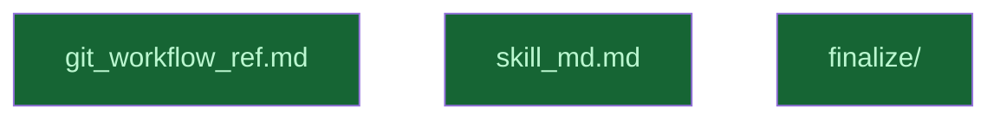

# Implement Skill Files

## Context

Executed after `content_mapping.md` (synthesis spec report exists) and `init_skill.md`
(skill directory scaffolded) are both complete. Produces the two files that constitute
the `committing-changes` skill: the lean `SKILL.md` and the detailed
`references/git-workflow.md`.

## Reference Documents

- [R01 Synthesis Map](../../../__reports__/create-committing-changes-skill/content-mapping.md) — content-to-file mapping, what goes in SKILL.md vs git-workflow.md, org rules to preserve, community gaps to add

## Goal

Author `SKILL.md` and `references/git-workflow.md` with content specified by the synthesis report.

## Pre-conditions

- [ ] `__reports__/create-committing-changes-skill/content-mapping.md` exists (output of `content_mapping.md`)
- [ ] `~/.claude/skills/committing-changes/` directory exists (output of `init_skill.md`)

## Success Gates

- ✅ `~/.claude/skills/committing-changes/references/git-workflow.md` exists with synthesized conventions
- ✅ `~/.claude/skills/committing-changes/SKILL.md` has valid frontmatter: `name: committing-changes`, description ≤1024 chars, body ≤500 lines
- ✅ SKILL.md body references `references/git-workflow.md` with clear load trigger

## Gotchas

- `git_workflow_ref.md` and `skill_md.md` are **parallel siblings** — they can be authored independently once the synthesis report exists
- SKILL.md body must stay lean (< 100 lines); all detailed rules belong in references/git-workflow.md
- Description must be in third person per official guidance

## Status

## Nodes

| Node | Type | Status |
|:-----|:-----|:-------|
| `git_workflow_ref.md` | 📄 Leaf Task | ✅ Done |
| `skill_md.md` | 📄 Leaf Task | ✅ Done |
| `finalize/` | 📁 Directory | ✅ Done |

## Amendment Log

| ID | Date | Source | Nodes Added | Rationale |
|:---|:-----|:-------|:------------|:----------|

## Progress

| Node | Branch | Commits | Notes |
|:-----|:-------|:--------|:------|
| `git_workflow_ref.md` | `task/git-workflow-ref` | 1 | 389-line reference file; all 10 sections present |
| `skill_md.md` | `task/skill-md` | 1 | Frontmatter PASS: name=committing-changes, desc=559 chars, body=37 lines |
| `finalize/` | — | — | — |
