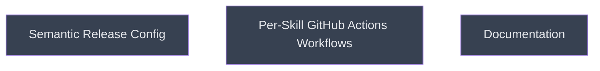

# CI Pipeline

## Context
Sequential phase after the pre-commit hook is working. Wires `semantic-release-monorepo` to GitHub Actions with one workflow per skill. `sr-config` and `workflows` are independent and run in parallel. Documentation runs after both are verified. Produces automated GitHub Releases with `.skill` assets on every push to `main`.

## Reference Documents
- [R01 Implementation Plan](~/.claude/plans/binary-jumping-trinket.md) — Phase 2 §7-§9, Phase 3 §10-§11

## Goal
Publish versioned `.skill` artifacts to GitHub Releases automatically on every skill change merged to `main`.

## Pre-conditions
- [ ] Pre-commit hook and Makefile working (`local-toolchain` complete)
- [ ] GitHub repo `GITHUB_TOKEN` has `contents: write` permission

## Success Gates
- ✅ `npx multi-semantic-release --dry-run` exits 0 with expected tag format (`<name>@1.0.0`)
- ✅ All 4 workflow files pass `actionlint` with no errors
- ✅ `CONTRIBUTING.md` and `README.md` installation guide committed to `main`

## Status

## Nodes
| Node | Type | Status |
|:-----|:-----|:-------|
| `sr-config.md` | 📄 Leaf Task | ⬜ Planned |
| `workflows.md` | 📄 Leaf Task | ⬜ Planned |
| `documentation/` | 📁 Directory | ⬜ Planned |

## Amendment Log
| ID | Date | Source | Nodes Added | Rationale |
|:---|:-----|:-------|:------------|:----------|

## Progress
| Node | Branch | Commits | Notes |
|:-----|:-------|:--------|:------|
