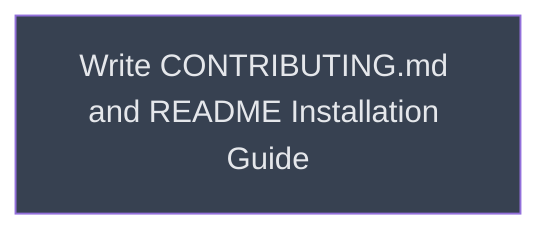

# Documentation

## Context
Final phase of the campaign, after the CI pipeline is verified working. Writes the contributor guide (`CONTRIBUTING.md`) and the user installation guide (`README.md`). Depends on CI workflows being final so install paths and URLs are accurate.

## Reference Documents
- [R01 Implementation Plan](~/.claude/plans/binary-jumping-trinket.md) — Phase 3 §10-§11
- [R02 Open questions](~/.claude/plans/binary-jumping-trinket.md#things-to-verify) — `.skill` double-click install, correct CLI paths

## Goal
Document how to contribute to and consume skills from this playbook.

## Pre-conditions
- [ ] CI pipeline verified (`sr-config` and `workflows` complete)
- [ ] `.skill` install path for Claude Code CLI confirmed (`~/.claude/skills/` vs `.agent/skills/`)
- [ ] Claude Desktop double-click install behavior verified

## Success Gates
- ✅ `CONTRIBUTING.md` covers: prerequisites, `make dev-setup`, hook behavior, `build-rust-local`, conventional commit format, first-run release note
- ✅ `README.md` covers: three install options (Releases, clone+build, build-from-source) with correct paths for Claude Code and Claude Desktop

## Status

## Nodes
| Node | Type | Status |
|:-----|:-----|:-------|
| `documentation.md` | 📄 Leaf Task | ⬜ Planned |

## Amendment Log
| ID | Date | Source | Nodes Added | Rationale |
|:---|:-----|:-------|:------------|:----------|

## Progress
| Node | Branch | Commits | Notes |
|:-----|:-------|:--------|:------|
