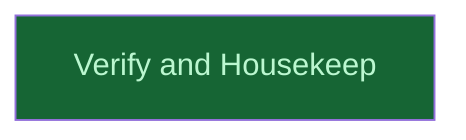

# Finalize Intake

## Context
Runs at depth +1 after the three intake siblings merge: it is the verification gate over the assembled set plus the repo-level housekeeping that intake surfaced (`.DS_Store` not gitignored). It produces the cross-skill verification report consumed by the coordinator before the release push.

## Goal
Verify the merged intake set as a whole and land the `.DS_Store` gitignore rule, clearing the way for the release push.

## Pre-conditions
- [ ] All three intake branches merged into `main` with their release quartets
- [ ] Untracked pristine originals moved out of the primary working tree

## Success Gates
- ✅ Cross-skill verification report at `__reports__/skills_intake_triplet/` records all-PASS `[static]`
- ✅ `git check-ignore skills/.DS_Store` exits 0 `[run]`

## Status

## Nodes
| Node | Type | Status |
|:-----|:-----|:-------|
| `verify_and_housekeep.md` | 📄 Leaf Task | ✅ Done |

## Amendment Log
| ID | Date | Source | Nodes Added | Rationale |
|:---|:-----|:-------|:------------|:----------|

## Progress
| Node | Branch | Commits | Notes |
|:-----|:-------|:--------|:------|
