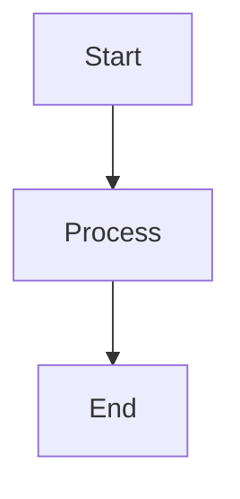
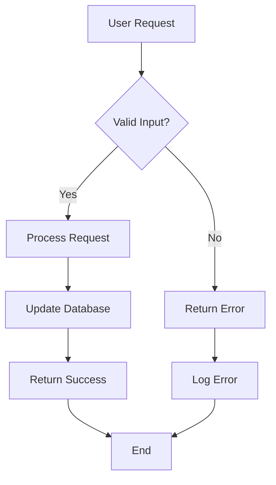
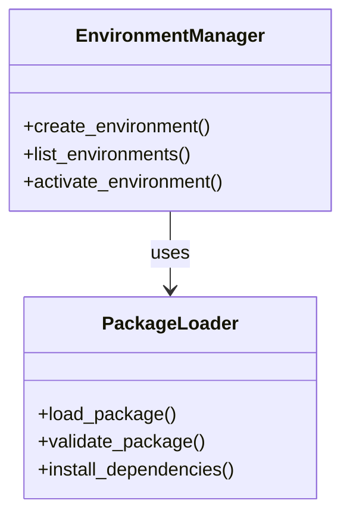
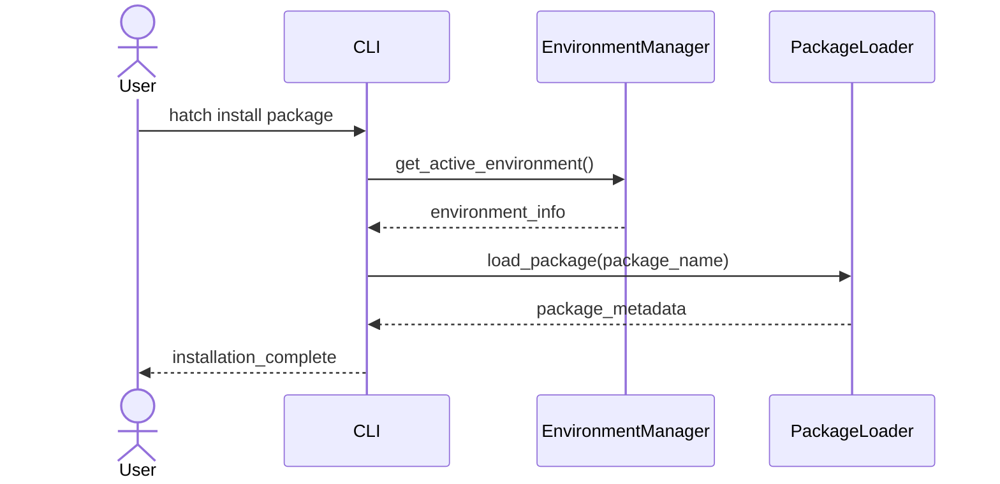
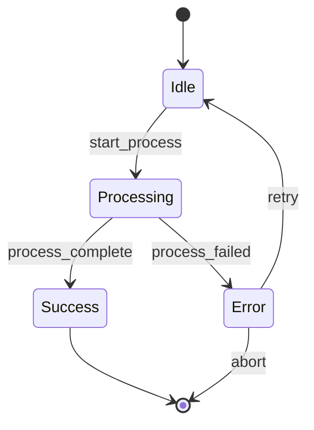
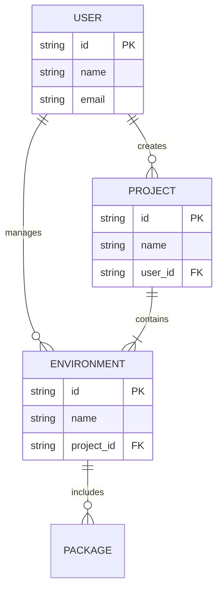
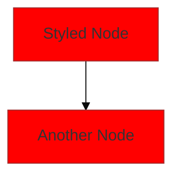
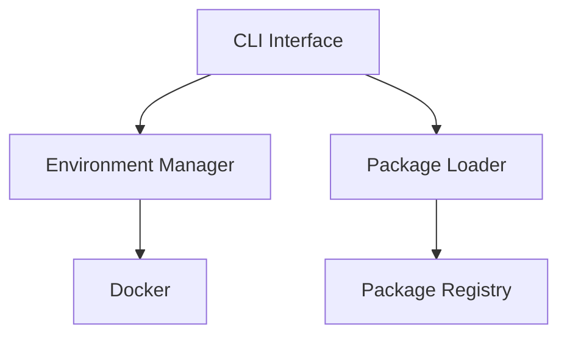
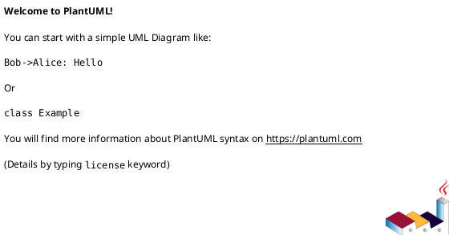

# Documentation Resources Instructions

## Overview
This file defines standards for managing non-markdown assets in documentation, including images, diagrams, and other resources.

**Diagram Standard Priority**: Mermaid diagrams are the PRIMARY standard for all new documentation. PlantUML is maintained as a legacy/alternative option for specific use cases.

## Resource Directory Structure

```
docs/resources/
├── diagrams/                   # Diagram source files
│   ├── mermaid/               # Mermaid diagrams (PRIMARY)
│   │   ├── architecture/      # System architecture diagrams
│   │   ├── workflows/         # Process and workflow diagrams
│   │   ├── api/               # API interaction diagrams
│   │   └── <diagram_name>.mmd # Individual Mermaid files
│   └── plantuml/              # PlantUML diagrams (LEGACY)
│       ├── architecture/      # System architecture diagrams
│       ├── workflows/         # Process and workflow diagrams
│       ├── api/               # API interaction diagrams
│       └── <diagram_name>.puml # Individual PlantUML files
└── images/                    # Images and other visual assets
    ├── screenshots/           # Application screenshots
    ├── logos/                 # Brand assets and logos
    ├── icons/                 # UI icons and symbols
    └── <image_name>.png      # Individual image files
```

## Mermaid Diagrams (PRIMARY STANDARD)

### Overview
**All new technical diagrams MUST be created using Mermaid** for consistency, native rendering, and maintainability.

### Why Mermaid?
- **Native rendering**: Works directly in GitHub, GitLab, and most markdown viewers
- **No external dependencies**: No rendering service required
- **Simpler syntax**: Easier to write and maintain
- **Better integration**: Works seamlessly with modern documentation tools
- **Real-time preview**: Supported in most modern IDEs
- **Version control friendly**: Plain text format with clear diffs

### When to Use Mermaid
- **All new documentation diagrams** (default choice)
- **Architecture diagrams** showing system components
- **Workflow and process diagrams** showing sequential steps
- **Data flow diagrams** showing information movement
- **State diagrams** showing system states and transitions
- **Entity relationship diagrams** for data models
- **Class diagrams** for object-oriented designs

### File Standards
- Write Mermaid diagrams in `docs/resources/diagrams/mermaid/`
- Use `.mmd` or `.mermaid` file extension (`.mmd` preferred)
- Use descriptive filenames that indicate the diagram's purpose
- Organize diagrams in subdirectories by category or system area

### Basic Structure
Mermaid diagrams can be embedded directly in markdown or stored in separate files:

**Inline in Markdown** (Recommended):
````markdown

````

**Separate File** (For complex diagrams):


### Diagram Types and Examples

#### Flowcharts / Graph Diagrams
For flowcharts and graph diagrams, reference Mermaid documentation at https://mermaid.js.org/syntax/flowchart.html

**Example Structure:**


**Direction Options:**
- `graph TD` - Top to bottom (default)
- `graph LR` - Left to right
- `graph BT` - Bottom to top
- `graph RL` - Right to left

#### Class Diagrams
For class diagrams, reference Mermaid documentation at https://mermaid.js.org/syntax/classDiagram.html

**Example Structure:**


#### Sequence Diagrams
For sequence diagrams, reference Mermaid documentation at https://mermaid.js.org/syntax/sequenceDiagram.html

**Example Structure:**


**Arrow Types:**
- `->` Solid line without arrow
- `-->` Dotted line without arrow
- `->>` Solid line with arrowhead
- `-->>` Dotted line with arrowhead
- `-x` Solid line with cross at end
- `--x` Dotted line with cross at end

#### State Diagrams
For state diagrams, reference Mermaid documentation at https://mermaid.js.org/syntax/stateDiagram.html

**Example Structure:**


#### Entity Relationship Diagrams
For ER diagrams, reference Mermaid documentation at https://mermaid.js.org/syntax/entityRelationshipDiagram.html

**Example Structure:**


### Mermaid Best Practices

#### Naming Conventions
- Use descriptive names that clearly indicate the diagram's purpose
- Use lowercase with hyphens (e.g., `system-architecture.mmd`)
- Include the diagram type in the name when helpful (e.g., `user-workflow-sequence.mmd`)

#### Content Guidelines
- Keep diagrams focused on a single concept or process
- Use consistent styling and terminology across related diagrams
- Include appropriate titles using Mermaid's title syntax
- Use meaningful names for actors, classes, and components
- Add comments using `%%` prefix for documentation

#### Technical Standards
- Always specify the diagram type at the start (e.g., `graph TD`, `sequenceDiagram`, `classDiagram`)
- Use consistent direction for flowcharts within the same documentation
- Use meaningful node IDs and labels
- Validate diagram syntax before committing (use Mermaid Live Editor: https://mermaid.live)
- Keep diagrams readable - split complex diagrams into multiple simpler ones

#### Styling and Theming


### Referencing Mermaid Diagrams

**Inline in Markdown** (Recommended):
````markdown
The following diagram illustrates the overall system architecture:



Key components include:
- **CLI Interface**: User-facing command-line interface
- **Environment Manager**: Handles virtual environment lifecycle
- **Package Loader**: Manages package installation and validation
````

**External File Reference** (For complex diagrams):
```markdown
See [System Architecture Diagram](../resources/diagrams/mermaid/system-architecture.mmd)
```

## PlantUML Diagrams (LEGACY/ALTERNATIVE)

### Overview
PlantUML is maintained as a legacy option for existing diagrams and specific use cases where Mermaid doesn't provide adequate functionality.

### When to Use PlantUML
- **Maintaining existing diagrams**: Update existing PlantUML diagrams rather than converting
- **Complex deployment diagrams**: PlantUML has better support for deployment diagrams
- **Specific diagram types**: When Mermaid doesn't support a needed diagram type
- **External tool integration**: When integrating with tools that specifically require PlantUML

### Migration Strategy
- **New diagrams**: Always use Mermaid
- **Existing diagrams**: Keep as PlantUML unless major updates are needed
- **Major updates**: Consider converting to Mermaid during significant revisions
- **No forced conversion**: Don't convert working PlantUML diagrams just for standardization

### File Standards
- Write PlantUML diagrams in `docs/resources/diagrams/plantuml/`
- Use `.puml` file extension
- Use descriptive filenames that indicate the diagram's purpose
- Organize diagrams in subdirectories by category or system area

### Basic Structure


### PlantUML Resources
- Class diagrams: https://plantuml.com/en/class-diagram
- Sequence diagrams: https://plantuml.com/en/sequence-diagram
- Component diagrams: https://plantuml.com/en/component-diagram
- Activity diagrams: https://plantuml.com/en/activity-diagram-beta
- Use case diagrams: https://plantuml.com/en/use-case-diagram
- Deployment diagrams: https://plantuml.com/en/deployment-diagram

## Image Management

### Supported Formats
- **PNG**: Preferred for screenshots and UI elements
- **JPG/JPEG**: For photographs and complex images
- **SVG**: For scalable graphics and simple illustrations
- **GIF**: For animated demonstrations (use sparingly)

### Naming Conventions
- Use descriptive names that indicate the image content
- Use lowercase with hyphens (e.g., `installation-screenshot.png`)
- Include version numbers for screenshots that may change (e.g., `ui-v2.1-dashboard.png`)

### Image Organization
```
docs/resources/images/
├── screenshots/               # Application screenshots
│   ├── installation/         # Installation process screenshots  
│   ├── ui/                   # User interface screenshots
│   └── cli/                  # Command-line interface screenshots
├── logos/                    # Brand assets and logos
│   ├── hatch-logo.png       # Main project logo
│   ├── hatch-icon.png       # Icon version
│   └── partners/            # Partner/dependency logos
├── icons/                    # UI icons and symbols
│   ├── error-icon.png       # Status icons
│   ├── warning-icon.png
│   └── success-icon.png
└── diagrams-rendered/        # Rendered versions (only if needed for special contexts)
    ├── architecture.png     # PNG exports for presentations or special tools
    └── workflows.png        # Note: Mermaid renders natively in most contexts
```

### Image Quality Standards
- **Screenshots**: Use consistent window sizes and zoom levels
- **Resolution**: Provide high-DPI versions for crisp display
- **Compression**: Balance file size with visual quality
- **Consistency**: Use consistent styling, fonts, and color schemes

### Referencing Images
Reference images in documentation using relative paths with alt text:

```markdown

```

Include descriptive captions when helpful:

```markdown

*The help output shows all available commands and their descriptions.*
```

## Asset Management Best Practices

### Version Control
- Include all source files (e.g., `.puml` files) in version control
- Consider including rendered versions for contexts where PlantUML isn't available
- Use meaningful commit messages when updating assets
- Tag important asset versions for reference

### File Size Management
- Optimize images for web display
- Use appropriate compression levels
- Consider providing multiple resolutions for different contexts
- Monitor total repository size and optimize when necessary

### Accessibility
- Always include descriptive alt text for images
- Ensure diagrams have sufficient color contrast
- Provide text descriptions for complex visual information
- Consider screen reader compatibility

### Maintenance
- Regularly review and update screenshots for accuracy
- Update diagrams when system architecture changes
- Remove unused assets to keep repository clean
- Validate that all referenced assets exist and are accessible

## Integration with Documentation

### Cross-References
- Link related diagrams and images within articles
- Create consistent navigation between visual and textual content
- Use images to support and clarify written explanations
- Provide context for standalone visual assets

### Documentation Flow
- Introduce visual assets with appropriate context
- Place images and diagrams near relevant text
- Use consistent formatting for captions and references
- Ensure visual assets enhance rather than distract from content

## Automation and Tools

### Mermaid Integration
- **Native rendering**: No special tools needed for GitHub/GitLab
- **MkDocs integration**: Use `mkdocs-mermaid2-plugin` for MkDocs sites
- **Validation**: Use Mermaid CLI or online editor (https://mermaid.live) for syntax validation
- **CI/CD**: Consider adding Mermaid syntax validation to CI pipeline
- **IDE support**: Most modern IDEs have Mermaid preview plugins

### PlantUML Integration (Legacy)
- Consider tools that can render PlantUML in documentation builds
- Set up validation for PlantUML syntax
- Automate generation of rendered versions when needed
- Integrate with CI/CD for diagram validation

### Image Optimization
- Use image optimization tools to reduce file sizes
- Automate consistent screenshot capture when possible
- Set up validation for image accessibility standards
- Monitor and report on asset usage and redundancy

## Quality Assurance

### Review Checklist
- [ ] All diagrams use consistent styling and terminology
- [ ] Images have appropriate alt text and captions
- [ ] File names follow naming conventions
- [ ] Assets are organized in appropriate directories
- [ ] All referenced assets exist and are accessible
- [ ] Large files are appropriately optimized
- [ ] Diagrams render correctly in documentation builds

### Regular Maintenance Tasks
- Review asset accuracy and relevance
- Update screenshots for UI changes
- Optimize file sizes and formats
- Validate accessibility compliance
- Clean up unused or redundant assets
- Update diagram content for system changes

## Related Guidelines
- See [Documentation Structure](./documentation-structure.instructions.md) for overall organization
- See [Documentation Style Guide](./documentation-style-guide.instructions.md) for content standards
- See [MkDocs Setup](./documentation-mkdocs-setup.instructions.md) for technical configuration
- See [API Documentation](./documentation-api.instructions.md) for API-specific assets