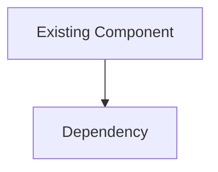
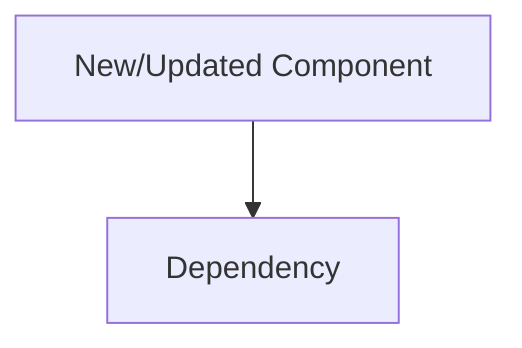
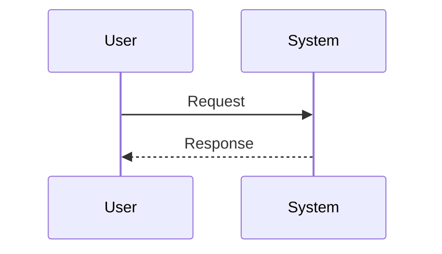

# Reporting Templates

These templates are designed to be stakeholder-reviewable and to prevent “code dump” reports.

---

## Template: Phase 1 — Architecture Analysis

````markdown
# <Topic> — Architecture Analysis (vN)

Date: YYYY-MM-DD

## Executive Summary
- Problem:
- Proposed change:
- Non-goals:
- Biggest risks:
- Validation approach (high level):

## Current State


## Proposed State


## Key Flows


## Contracts & Invariants
- Interfaces (signatures / schemas):
- Invariants:
- Error model:
- Pseudo-code (only for non-trivial logic):

## Alternatives Considered
- Option A:
- Option B:
- Decision and rationale:

## Risks & Mitigations
- Risk 1:
- Risk 2:

## Roadmap Recommendation
- If complex, create `__design__/<topic>_roadmap_vN.md` using `instructions/roadmap-generation.instructions.md`.
- Milestone sketch (if not creating a full roadmap):
  - Milestone 1:
  - Milestone 2:
````

---

## Template: Phase 2 — Test Definition

````markdown
# <Topic> — Test Definition (vN)

Date: YYYY-MM-DD

## Executive Summary
- What must be proven:
- Top risks and how tests address them:
- Estimated test volume and tiers (dev/regression/integration):

## Scope
### In scope
### Out of scope
### Assumptions
### Trust boundaries

## Test Matrix
| Group | Scenario | Risk it covers | Tier | Setup / Data | Assertion (observable) |
|------:|----------|----------------|------|--------------|-------------------------|
| Core | ... | ... | regression | ... | ... |

## Fixtures / Test Data Strategy
- Data needed:
- Where it lives (`tests/test_data/...`):
- Mock vs real strategy:

## Observability Requirements
- Logs/metrics/events required to validate behavior:

## Minimal Must-Run Regression Set
- Test 1:
- Test 2:

## Scope Control Notes
- Consolidations made:
- Justification for any unusually large test count:
````

---

## Template: Knowledge Transfer

````markdown
# <Topic> — Knowledge Transfer (vN)

Date: YYYY-MM-DD

## Executive Summary
- What shipped / changed:
- Primary outcomes:

## Wins
- 

## Pain Points
- 

## Root Causes
- 

## Next-cycle Changes
- Instruction changes:
- Workflow changes:
- Review process changes:

## Artifacts to Preserve
- 

## Open Questions
- 
````
