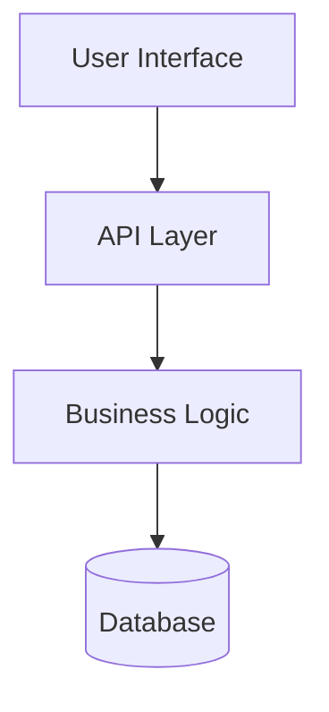

# Reporting Guidelines

## Overview

This document provides comprehensive guidance for creating, organizing, and iterating on reports throughout the development workflow. Reports serve as critical documentation of analysis, testing, implementation, and knowledge transfer.

---

## 1. Report Location and Directory Structure

### Default Report Location

Unless explicitly specified otherwise, save all reports to:
```
<workspace_root>/__reports__/<topic>/<descriptive_filename>_v<version>.md
```

### Path Components Explained

- **`<workspace_root>`**: The root directory of the current repository/workspace
- **`<topic>`**: Clear, descriptive folder name related to the report's subject matter (e.g., feature_version_command, bug_fix_memory_leak, refactor_api_layer, analysis_performance)
- **`<descriptive_filename>.md`**: Meaningful filename that clearly indicates the report's content

### Directory Creation Rules

- **Auto-create missing directories**: Create the relevant topic directory if it doesn't exist
- **Session organization**: Keep all files from a single work session within the same topic directory for clarity
- **Naming conventions**:
  - Use snake_case for directory and file names
  - Avoid spaces and special characters
  - Make names descriptive and self-explanatory
  - Prefix topic names with type for clarity (e.g., `feature_`, `bug_fix_`, `refactor_`, `analysis_`)

### Example Structure

```
project_root/
├── __reports__/                              # Temporary reports (periodic cleanup)
│   ├── feature_version_command/              # Topic
│   │   ├── README.md                         # Directory overview
│   │   ├── 00-analysis_v0.md
│   │   ├── 00-analysis_v1.md
│   │   ├── 01-test_definition_v0.md
│   │   ├── 01-test_definition_v1.md
│   │   └── 02-implementation_summary_v0.md
│   ├── bug_fix_memory_leak/                  # Topic
│   │   ├── 00-debugging_report_v0.md
│   │   └── 01-fix_summary_v0.md
│   └── refactor_api_layer/                   # Topic
│       ├── 00-analysis_v0.md
│       └── 01-implementation_v0.md
└── __design__/                               # Long-term design documents (permanent)
    ├── architecture_overview.md
    ├── roadmap_v1.md
    └── api_design_decisions.md
```

### Report vs Design Document Distinction

**`__reports__/`** - Temporary documentation:
- Implementation reports (analysis, test definitions, execution results)
- Debugging reports
- Knowledge transfer reports
- Work-in-progress documentation
- **Lifecycle**: Periodic cleanup (archive or delete after project completion)
- **Purpose**: Track development progress and decisions during active work

**`__design__/`** - Permanent documentation:
- Architecture documents
- Product roadmaps
- Design decisions and rationale
- API specifications
- System design documents
- **Lifecycle**: Maintained long-term as reference
- **Purpose**: Long-term reference for understanding system design and strategic decisions

**When to use which**:
- Use `__reports__/` for: Work-in-progress documentation, iteration tracking, temporary analysis, implementation records
- Use `__design__/` for: Finalized architecture, stable roadmaps, design decisions that affect long-term maintenance, strategic planning documents

---

## 2. Naming Convention and Versioning

### Two-Part Naming Scheme

```
<round_prefix>-<descriptive_name>_v<version>.md
```

**Components**:
- **Round Prefix** (00-, 01-, 02-, etc.): Increments with each new user prompt or work session
- **Descriptive Name**: Clear, meaningful name describing the report content (snake_case)
- **Version Suffix** (_v0, _v1, _v2, etc.): Increments with each iteration of the same report

### Examples

```
# First round (initial user request)
00-version_command_analysis_v0.md          # Initial analysis
00-version_command_analysis_v1.md          # After user feedback/iteration

# Second round (user requests refinement or new analysis)
01-test_definition_v0.md                   # Initial test definition
01-test_definition_v1.md                   # After critical review

# Third round (user requests implementation)
02-implementation_summary_v0.md            # Implementation report

# Fourth round (user requests additional feature)
03-feature_extension_analysis_v0.md        # New analysis for extension
```

### Rationale

- **Round prefix** tracks work sessions and user prompts (chronological progression)
- **Version suffix** tracks iterations within a single work session (refinement progression)
- **Clear evolution**: Stakeholders can easily see report history and current state
- **No name changes**: Same report keeps same descriptive name across versions

### When to Increment

- **Round**: New user prompt, new work session, or new phase of work
- **Version**: Iteration/refinement of existing report based on feedback

### Legacy Reports

Existing reports without round prefixes can be retroactively numbered or left as-is. New reports should follow this convention.

---

## 3. README File Convention

### Purpose

Each report directory should contain a README.md file that provides a quick overview and navigation guide for all reports in that directory.

### Template Structure

Based on successful pattern from `version_command/README.md`:

```markdown
# [Feature/Topic Name]

Brief description of the feature or topic covered in this directory.

## Documents

### Phase 1: Analysis
- **[report_name_v1.md](./report_name_v1.md)** ⭐ **CURRENT** - Brief description
  - Key points or highlights
- **[report_name_v0.md](./report_name_v0.md)** 📦 **ARCHIVED** - Brief description

### Phase 2: Test Definition
- **[test_definition_v1.md](./test_definition_v1.md)** ⭐ **CURRENT** - Brief description
- **[test_definition_v0.md](./test_definition_v0.md)** 📦 **ARCHIVED** - Brief description

### Supporting Documents
- **[prompts.md](./prompts.md)** - Original user prompts and requirements
- **[implementation_summary.md](./implementation_summary.md)** - Implementation report
- **[knowledge_transfer_report.md](./knowledge_transfer_report.md)** - Lessons learned

## Quick Summary

### Critical Findings
- Key finding 1
- Key finding 2

### Recommended Approach
- Approach summary

### Implementation Results
- Status indicators
- Test results
- Git commits

## Status
- ✅ Phase 1: Complete
- ✅ Phase 2: Complete
- ⏳ Phase 3: In Progress

---

**Last Updated**: YYYY-MM-DD
```

### README Maintenance

- **Update after each phase**: Add new reports and update status
- **Mark current versions**: Use ⭐ **CURRENT** for active reports
- **Archive old versions**: Use 📦 **ARCHIVED** for superseded reports
- **Quick summary**: Provide high-level overview for stakeholders
- **Status tracking**: Show phase progression clearly

---

## 4. Report Quality Standards

- Use proper markdown formatting
- Include clear headings and structure
- Add table of contents for longer reports
- Use code blocks, tables, and lists appropriately
- Ensure content is well-organized and readable
- **Use Mermaid diagrams** to visualize complex information (see Visual Documentation Standards below)

### Implementation Notes

- Always confirm the repository root before creating paths
- Group related reports under the same topic directory
- Use consistent naming patterns within each topic folder

---

## 4.1. Visual Documentation Standards

### Overview
**PRIORITY**: Use Mermaid diagrams to enhance report clarity and comprehension. Visual representations significantly improve understanding of complex systems, workflows, and architectures.

### When to Use Diagrams in Reports

**MUST USE diagrams for**:
- System architecture descriptions
- Workflow and process flows
- Data flow and transformations
- State transitions and lifecycle management
- Component relationships and dependencies
- Decision trees and conditional logic

**SHOULD USE diagrams for**:
- Class hierarchies and object relationships
- API interaction patterns
- Database schema and entity relationships
- Test strategy and coverage visualization
- Performance analysis and bottleneck identification

### Mermaid Diagram Types for Reports

Use the appropriate diagram type for your content:

- **Flowcharts/Graphs** (`graph TD`): System architecture, process flows, decision trees
- **Sequence Diagrams** (`sequenceDiagram`): API interactions, component communication
- **State Diagrams** (`stateDiagram-v2`): Lifecycle management, state transitions
- **Entity Relationship Diagrams** (`erDiagram`): Database schemas, data models
- **Class Diagrams** (`classDiagram`): Object-oriented designs, class hierarchies

**Example - Architecture in Analysis Report**:
````markdown

````

**For complete Mermaid syntax and examples**, see [Documentation Resources - Mermaid Diagrams](./documentation-resources.instructions.md#mermaid-diagrams-primary-standard).

### Best Practices for Diagrams in Reports

#### Placement and Context
- Introduce diagrams with context before showing them
- Highlight key points after the diagram
- Reference specific diagram elements in explanations
- Keep one concept per diagram

#### Diagram Quality
- Use clear, descriptive labels
- Maintain consistent styling within a report
- Split overly complex diagrams into multiple simpler ones
- Validate syntax at https://mermaid.live before committing

#### Integration with Report Types

| Report Type | Use Diagrams For |
|-------------|------------------|
| **Analysis** | Current vs. proposed architecture, data flows, decision trees |
| **Test Definition** | Test strategy overview, dependency graphs, execution flow |
| **Implementation** | Component relationships, integration points, migration paths |
| **Knowledge Transfer** | System overview, interaction patterns, troubleshooting trees |

---

## 5. Report Iteration and Refinement Workflow

### Standard Iteration Process

**All analysis and test definition reports should undergo at least one refinement iteration** before proceeding to implementation. This pattern consistently produces higher-quality deliverables.

**Iteration Workflow**:
1. **Initial Report (v0)**: Comprehensive analysis or test suite covering all identified scenarios
2. **User Review**: Stakeholder reviews v0 and provides critical feedback
3. **Refinement (v1)**: Streamlined, focused version addressing feedback
4. **Approval**: User approves v1 for implementation
5. **Additional Iterations**: Repeat as needed until approval

### Critical Evaluation Questions

**For Analysis Reports (Phase 1)**:
- Is the analysis comprehensive yet focused?
- Are all referenced file paths, line numbers, and code snippets accurate?
- Is the implementation guidance clear and actionable?
- Are alternative approaches adequately evaluated?
- Can any sections be streamlined without losing critical information?

**For Test Definition Reports (Phase 2)**:
- Are we testing our implementation or standard library/framework behavior?
- Does each test add unique value?
- Can tests be consolidated without losing coverage?
- Is the test suite focused on critical paths?
- Are we over-engineering the test infrastructure?

### Documenting Refinements

**Version Numbering**: Use sequential versioning (v0, v1, v2, etc.)

**Changes Documentation**: Each refined version should include a "Changes from v{N-1}" section explaining:
- What was removed and why
- What was added and why
- What was restructured and why
- How the refinement improves quality

**Example**:
```markdown
## Changes from v0

### Removed (5 tests eliminated)
- Removed 4 standard library behavior tests (trust Python stdlib)
- Removed 1 redundant subprocess test (covered by integration test)

**Rationale**: Focus on our implementation logic, not standard library behavior

### Consolidated
- Merged 2 test classes into 1 (simpler structure)

**Outcome**: 50% reduction in test count, same coverage, improved maintainability
```

### Benefits of Iteration

- **Quality Improvement**: Refinement produces more focused, maintainable deliverables
- **Stakeholder Alignment**: Ensures implementation matches expectations
- **Knowledge Capture**: Iteration process captures decision rationale
- **Risk Reduction**: Identifies issues before implementation begins

---

## 6. Report Type Definitions

### Test Definition Report

**MUST DO**: Generate a comprehensive test definition report before any implementation begins.

Tests will be used to verify that code changes implemented by the coding agent behave as expected.

**Report Requirements**:
- **Mandatory inclusion** in all preparation reports that precede implementation work
- **Test categorization** based on task type:
  - **Feature tests**: Derived from user-defined use cases or discovered during preparation discussions. These become permanent regression/integration tests (reference org's Testing Guidelines for classification)
  - **Fix tests**: Focused on verifying the specific bug no longer occurs, plus validation that existing functionality remains intact. These are typically temporary "development" tests (reference org's Testing Guidelines for classification)
- **Test specification components**:
  - Test case definitions with clear input/output expectations
  - Test data requirements and setup procedures
  - Expected behavior documentation for edge cases
  - Validation criteria and success metrics
- **User validation workflow**: Default behavior requires at least one report iteration with user approval. The coding agent must present the test definition report and engage in refinement discussions with the user before proceeding to implementation.

**Agent Action**: Present test definitions in a structured report format that facilitates user review and iterative refinement.

### Test Execution and Validation Report

**MUST DO**: Generate a comprehensive test execution report demonstrating implementation completeness.

This report provides evidence that the implementation meets all requirements and maintains system integrity.

**Report Requirements**:
- **Complete test execution results**: All defined tests from the upstream Test Definition Report must be executed and documented
- **Performance verification**: Benchmark results and performance criteria validation
- **Regression confirmation**: Evidence that existing functionality remains unaffected
- **Edge case validation**: Documentation of boundary condition testing outcomes
- **User review process**: Present execution results for user validation, highlighting any deviations from expected outcomes

**Agent Action**: Generate a structured execution report that clearly demonstrates requirement fulfillment and enables user verification.

### Documentation Update Report

**MUST DO**: Generate a documentation impact analysis and update report after implementation completion.

Documentation represents the organization's front-facing knowledge base and must remain current with all code changes.

**Report Requirements**:
- **Comprehensive documentation search**: Systematically identify all documentation sections potentially affected by the implementation
- **Impact analysis**: Document which sections require updates and why
- **Update proposals**: Present specific documentation changes following:
  - Organization's documentation guidelines
  - Existing documentation style and format
- **User review process**: Present the documentation update report for user validation and refinement before applying changes

**Agent Action**: Generate a structured report detailing documentation impacts and proposed updates that enables user review and collaborative refinement.

### Knowledge Transfer Report

**MUST DO**: Generate a knowledge transfer report to facilitate future development and feature chaining.

This report captures implementation insights and creates a foundation for subsequent development work.

**Report Requirements**:
- **Implementation summary**: High-level overview of what was built and how it works
- **Key decisions documentation**: Technical choices made during implementation with rationale
- **Lessons learned**: Insights gained during development that could benefit future work
- **Integration points**: How this implementation connects with existing systems and potential extension points
- **Troubleshooting guide**: Common issues and resolution approaches discovered during implementation
- **Future development enablers**: Identified opportunities for feature enhancement or related implementations
- **User collaboration**: Present the knowledge transfer report for user review to ensure critical insights are captured and accessible for team knowledge sharing

**Agent Action**: Generate a comprehensive knowledge transfer document that serves as both implementation record and development catalyst for future work.

