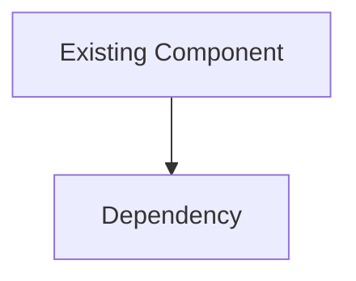
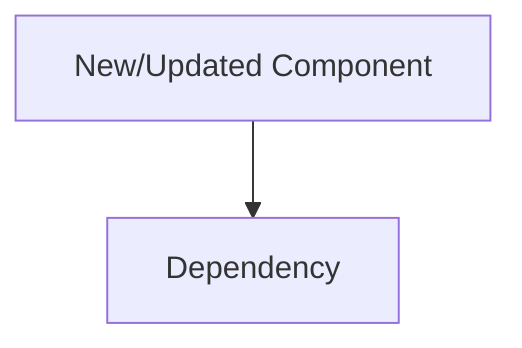
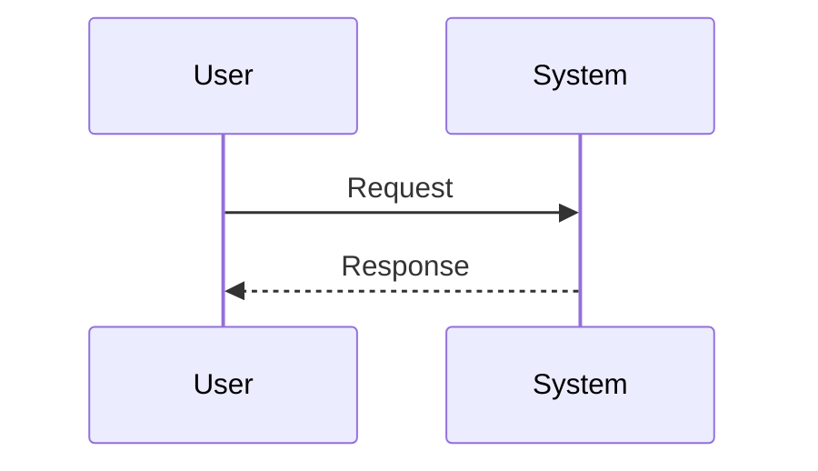

# Software Architecture Analysis Reports

Produce at the **analysis stage**, before writing any implementation code.

---

## Required Artifacts

Every architecture analysis report must include all four of the following:

1. **At least one Mermaid diagram** — choose the type that best communicates the change: component/dependency flow, key request-response sequence, state lifecycle, or ER schema.
2. **Contracts & invariants** — interfaces, input/output schemas, error model, and invariants.
3. **Alternatives considered** — options evaluated, winning approach, and tradeoffs accepted.
4. **Risk register** — top risks and mitigations.

---

## Contracts & Invariants

Prefer *interfaces* over implementations.

Include:
- Input/output schemas or type signatures
- Error model (what fails, how it surfaces)
- Invariants (what must always be true)
- Pseudo-code for non-trivial logic only (focus on observable behavior)

**Forbidden**: full class/module definitions, full function bodies.

---

## Alternatives & Decisions

For each major decision, document:
- Options considered
- Why the chosen approach wins
- Tradeoffs accepted

---

## Roadmap Handoff

If the effort is complex or multi-phase, end the analysis report with a roadmap handoff. Use the `managing-roadmaps` skill to produce a directory tree under `__roadmap__/<campaign>/`.

---

*Adapt sections as needed.*

## Template: Architecture Analysis

````markdown
# <Topic> — Architecture Analysis (vN)

Date: YYYY-MM-DD

## Executive Summary
- Problem:
- Proposed change:
- Non-goals:
- Biggest risks:
- Validation approach (high level):

## Current State


## Proposed State


## Key Flows


## Contracts & Invariants
- Interfaces (signatures / schemas):
- Invariants:
- Error model:
- Pseudo-code (only for non-trivial logic):

## Alternatives Considered
- Option A:
- Option B:
- Decision and rationale:

## Risks & Mitigations
- Risk 1:
- Risk 2:

## Roadmap Recommendation
- If complex, create a roadmap directory tree under `__roadmap__/<campaign>/` using the `managing-roadmaps` skill.
- Milestone sketch (if not creating a full roadmap):
  - Milestone 1:
  - Milestone 2:
````
